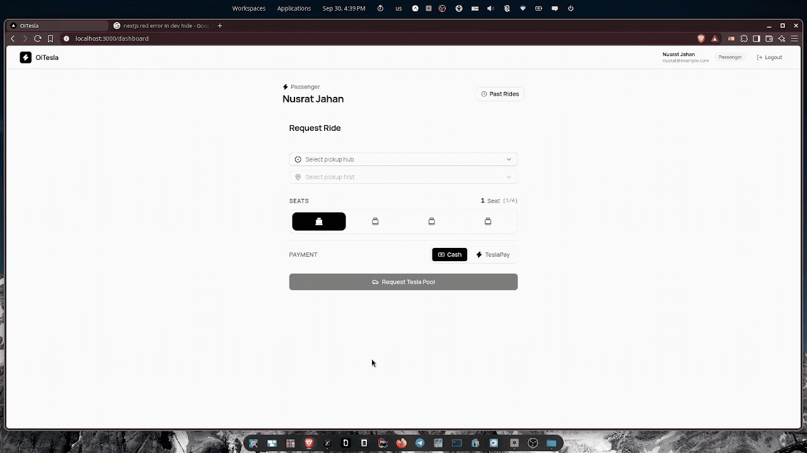
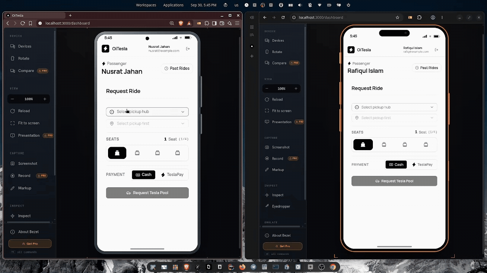
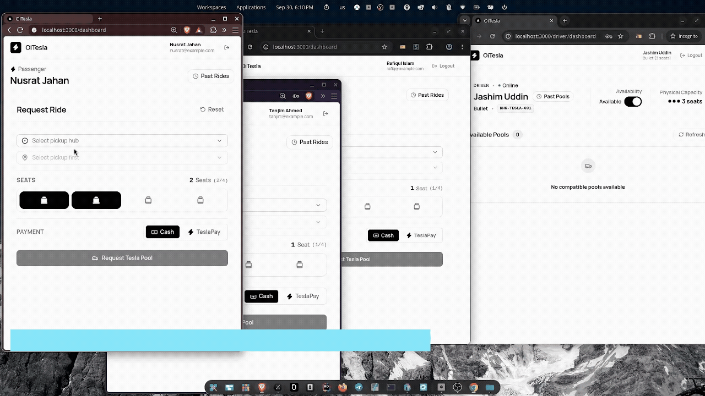

# OiTesla

Shared ride-pooling platform for electric three-wheelers in Dhaka.

## Table of Contents

- [Problem Statement](#problem-statement)
- [Tech Stack](#tech-stack)
- [Feature List](#feature-list)
  - [1. Account and Profile Management](#1-account-and-profile-management)
  - [2. Ride Booking and Upfront Fare Estimates](#2-ride-booking-and-upfront-fare-estimates)
  - [3. Supported Routes and Geographic Matching](#3-supported-routes-and-geographic-matching)
  - [4. Deterministic Ride-Pooling Engine](#4-deterministic-ride-pooling-engine)
  - [5. Seat Allocation and Overbooking Prevention](#5-seat-allocation-and-overbooking-prevention)
  - [6. Trip Lifecycle and Real-Time Tracking](#6-trip-lifecycle-and-real-time-tracking)
  - [7. Distance-Proportional Fare Calculation](#7-distance-proportional-fare-calculation)
  - [8. Driver Console and Trip Operations](#8-driver-console-and-trip-operations)
  - [9. Cancellations](#9-cancellations)
  - [10. Payment Settlement](#10-payment-settlement)
  - [11. Ride History and Audit Log](#11-ride-history-and-audit-log)
  - [12. Privacy and Data Separation](#12-privacy-and-data-separation)
- [Project Structure](#project-structure)
- [Prerequisites](#prerequisites)
- [Getting Started](#getting-started)
- [Database Schema](#database-schema)
- [API Overview](#api-overview)
- [Documentation Index](#documentation-index)

---

## Problem Statement

During Dhaka’s peak hours, passengers traveling along overlapping routes often book separate rides even when a vehicle has unused seats. For example, a passenger traveling from Banani to Mohakhali and another traveling from Banani to Gulshan may both need the same vehicle for part of their journeys, but there is no simple mechanism to match them while respecting route overlap, available seats, pickup order, and individual fares.

This creates three concrete problems: passengers pay unnecessarily high fares for solo trips, drivers leave seats unused, and multiple vehicles make similar journeys through congested roads.

---

## Tech Stack

| Layer | Technology | Version |
|---|---|---|
| Frontend | Next.js (App Router) + React + TypeScript | Next 16, React 19 |
| Styling | Tailwind CSS v4 + shadcn/ui | Tailwind 4, shadcn 4 |
| State Management | Zustand + TanStack React Query | Zustand 5, RQ 5 |
| HTTP Client | Axios | 1.20 |
| Backend | Node.js + Express + TypeScript | Node 20+, Express 4 |
| Database | PostgreSQL | 18 (Alpine) |
| ORM | Drizzle ORM + Drizzle Kit | 0.45 |
| Auth | JWT (HS256) via `jose` | 6.x |
| Validation | Zod | 3.24 |
| Logging | pino + pino-http | 9.x / 10.x |
| Testing | Vitest | 5.x |
| Containerization | Docker Compose | multi-stage build |
| Money | Integer paisa (`BIGINT`) | — |

> See [`docs/Tech-stack.md`](docs/Tech-stack.md) for detailed justifications behind each choice.

---


## Feature List

### 1. Account and Profile Management

The system maintains two distinct user roles with dedicated interfaces and permissions:

* **Passenger Registration and Login:** Passengers register with a name, email address, and password. Once logged in, passengers can request rides, monitor active trips, view payment statuses, and review their personal ride history.
* **Driver and Vehicle Registration:** Drivers register an account while registering their vehicle. Vehicle details require an operational name (such as *"Bullet"*), a registration plate number, and a passenger seating capacity (between 1 and 6 seats; standard default is 3).
* **Credential Security:** The application stores passwords as cryptographic hashes using the scrypt algorithm with per-user salt. Plaintext passwords never reach storage.
* **Session Management:** Authenticated sessions issue JSON Web Tokens (JWT) valid for 24 hours. The web client stores tokens in session memory to preserve active sessions across page refreshes while restricting persistence to browser close.

### 2. Ride Booking and Upfront Fare Estimates



Passengers request rides through an interactive booking form that prices trips prior to driver dispatch:

* **Location Selection:** Passengers choose pickup and drop-off points from a supported directory of Dhaka locations (including Banani, Gulshan, Mohakhali, Dhanmondi, Mirpur, Uttara, Farmgate, and Bashundhara).
* **Seat Reservation:** Passengers specify the exact number of seats required for their party (from 1 to 4 seats).
* **Upfront Solo Fare Preview:** The system calculates and displays a preliminary solo fare estimate before the passenger submits the request.
* **Payment Preference:** Passengers select their intended payment method (`Cash` or `TeslaPay`) when booking.
* **Route Validation:** The system accepts bookings only between locations connected by established transit routes. Requests between disconnected zones receive an immediate rejection rather than an unverified estimate.

### 3. Supported Routes and Geographic Matching

The platform matches riders along fixed directional routes with predetermined segment distances:

* **Fixed Route Chains:** Travel paths are structured as ordered location chains (for example, *Banani → Gulshan → Mohakhali* or *Mirpur → Farmgate → Dhanmondi*).
* **Integer Segment Distances:** Road distances between consecutive stops are stored in integer meters. Identical road segments (such as Banani to Gulshan) share identical distance measurements across every route that includes them.
* **Directional Segments:** Routes are strictly one-way. A vehicle traveling southbound serves only downstream destinations; travel in the opposite direction requires the designated reverse route.
* **Prohibited Intermediate Pickups:** All passengers sharing a pool must board at the same initial pickup point. Picking up additional riders mid-trip is prohibited.

### 4. Deterministic Ride-Pooling Engine



When a passenger books a trip, the system immediately pairs them with a compatible pool or opens a new pool:

* **Eager Formation:** The platform places every booking into a pool the moment the passenger requests it, grouping compatible passengers before a driver accepts.
* **Compatibility Criteria:** Two or more passenger requests share a pool only when:
  1. They start at the exact same pickup location.
  2. All passenger destinations lie downstream along the same active route.
  3. The combined seat count does not exceed vehicle capacity.
  4. The pool has not yet departed.
* **All-Pairs Verification:** A new passenger joins a pool only if their destination is compatible with every rider already in that vehicle. This prevents routing conflicts where one passenger's drop-off point deviates from the vehicle's line of travel.
* **Earliest Pool Priority:** If multiple open pools match a request, the passenger joins the pool created earliest.
* **Capacity Overflow Handling:** If an existing pool reaches full capacity, the platform does not drop incoming requests. It places the new request into a separate open pool for another driver to accept.

### 5. Seat Allocation and Overbooking Prevention



Vehicle capacity operates under strict concurrency controls to guarantee seats are never oversold:

* **Atomic Seat Counting:** Passenger additions execute as atomic database updates. The update increments the seat tally only if the pool remains in an open state and the new total fits within vehicle capacity.
* **Race Condition Resolution:** If two passengers attempt to reserve the final remaining seat simultaneously, the database locks the record, approves the first transaction, and rejects the second with an out-of-seats notice.
* **Physical Seat Backstop:** Database check constraints reject any transaction that would push occupied seats past vehicle capacity, eliminating overbooking.

### 6. Trip Lifecycle and Real-Time Tracking

Every shared trip progresses through five consecutive stages:

```text
REQUESTED / OPEN ──► MATCHED ──► DRIVER_ARRIVED ──► STARTED ──► COMPLETED
```

* **Trip States:**
  * `REQUESTED` / `OPEN`: The passenger submitted a request. The system formed or joined a pool awaiting driver assignment.
  * `MATCHED`: An online driver accepted the pool.
  * `DRIVER_ARRIVED`: The driver arrived at the designated pickup stop.
  * `STARTED`: The driver began the trip with all riders on board. At this transition, passenger fares freeze permanently, and no additional riders may join.
  * `COMPLETED`: The driver reached all passenger destinations, closing the pool and generating payment records.
* **Enforced State Flow:** Transitions move forward in sequence. Reversing a state (such as moving from `COMPLETED` back to `STARTED`) or skipping steps triggers a server error.
* **Live Passenger Status Updates:** The passenger screen checks the server every five seconds to reflect driver arrival, journey progress, and trip completion without requiring manual page reloads.

### 7. Distance-Proportional Fare Calculation

Individual fares decrease as more passengers join, with riders traveling farther paying a proportional share:

* **Total Trip Cost:** Trip cost is determined by the vehicle's longest passenger leg:
  `Trip Total = Base Fare (30 BDT) + (Distance Rate (20 BDT/km) × Farthest Destination Distance)`
* **Proportional Distance Splitting:** The shared trip cost is divided among passengers based on their personal travel distances:
  `Passenger Share = Trip Total × (Passenger Distance / Sum of All Passenger Distances)`
  Passengers who travel farther pay more, while passengers disembarking earlier pay less.
* **Dynamic Sharing Discounts:** When a new passenger joins an open pool, the system recalculates and lowers every active member's fare.
* **Exact Integer Rounding:** Fares are calculated in integer paisa (100 paisa = 1 BDT). Fractional paisa are distributed using the largest-remainder method, ensuring the sum of all individual fares equals the vehicle's total fare down to the exact paisa.
* **Permanent Fare Lock:** All passenger fares lock the moment the driver marks the trip as `STARTED`. Subsequent cancellations or changes cannot alter the amount due.

### 8. Driver Console and Trip Operations

Drivers manage vehicle status and active trips through a dedicated console:

* **Availability Toggle:** Drivers toggle their status between `ONLINE` and `OFFLINE`. Only online drivers receive ride alerts and pool proposals. Going offline does not interrupt an ongoing trip.
* **Available Pool Feed:** Online drivers view pending pools that match their vehicle's capacity, showing pickup points, drop-off stops, and seat counts. Passenger fares remain hidden on this screen.
* **Pool Acceptance:** Drivers claim an open pool with a single tap. The system assigns the driver and vehicle to the pool, switches the pool to `MATCHED`, and notifies riders. Drivers can hold only one active pool at a time.
* **Pool Decline:** Drivers can decline an unaccepted pool. The pool disappears from their view but remains open for other drivers.
* **Passenger Manifest:** Once a driver accepts a pool, the console displays the full roster: passenger names, drop-off stops, seats occupied, and individual fares.
* **Lifecycle Controls:** Step-by-step buttons let the driver report arrival at pickup, start the trip, and confirm trip completion.

### 9. Cancellations

The platform defines strict rules for passenger and pool cancellations:

* **Passenger-Initiated Cancellation:** A passenger can cancel a trip at any time while the status remains `REQUESTED` or `MATCHED`.
* **Immediate Seat Release:** Cancelling immediately releases the passenger's reserved seats back to the pool, allowing other travelers to take them, and rebalances remaining members' fares.
* **Automatic Pool Closure:** If every passenger in a pool cancels before pickup, the system soft-cancels the pool and removes it from driver listings.
* **Late Cancellation Lock:** Once the driver marks arrival (`DRIVER_ARRIVED`) or starts the trip (`STARTED`), passengers can no longer cancel.
* **Driver Cancellations Excluded:** Drivers cannot cancel a pool once they have accepted it; they can only decline pools before acceptance.

### 10. Payment Settlement

The application supports post-trip settlement through two payment options:

* **Automatic Payment Generation:** When a driver completes a trip, the system creates a `PENDING` payment record for each active passenger matching their locked fare.
* **TeslaPay (Digital Settlement):** Passengers who select TeslaPay tap a "Pay Now" button on their ride screen. The application records the transaction as `PAID` with the passenger's user ID and timestamp.
* **Cash Settlement:** Passengers who choose cash pay the driver directly upon arrival. The driver confirms payment via a "Mark Cash Received" button on their console, which marks the record as `PAID`.
* **Settlement Separation:** Payments serve as settlement accounting; unpaid balances do not halt vehicle progression or block pool completion.

### 11. Ride History and Audit Log

The system preserves past trip records for users and maintains an audit log:

* **Passenger Ride History:** Passengers can review all previous trips, including pickup and drop-off locations, dates, seat counts, final fares paid, and payment statuses.
* **Driver Trip Logs and Earnings:** Drivers can review completed pools, passengers served, total seats occupied, and aggregate earnings calculated across completed trips.
* **Append-Only Audit Trail:** State modifications write to an immutable audit log (`ride_events`). Each entry records:
  * Event category (such as request created, driver matched, arrived, started, completed, cancelled, or seat released)
  * Actor role and user ID (`PASSENGER`, `DRIVER`, or `SYSTEM`)
  * Associated pool and ride IDs
  * Starting state and target state
  * Event timestamp and metadata snapshot
  
  Audit records cannot be edited or deleted, allowing reconstruction of any trip.

### 12. Privacy and Data Separation

The application enforces data boundaries between passengers and drivers:

* **Passenger Fare Privacy:** A passenger can view only their own fare, route details, and payment state. The platform never exposes what other riders in the vehicle paid.
* **Restricted Manifest Access:** Passenger names and seat allocations are visible only to the driver assigned to that specific pool.
* **Server-Side Authorization:** Every database read and write verifies the caller's identity and user role against session credentials. Request parameters cannot be manipulated to access or alter another user's ride.

---

## Project Structure

```
OiTesla/
├── client/                          # Next.js App Router frontend
│   ├── app/
│   │   ├── (auth)/                  # Login / register pages
│   │   ├── (driver)/                # Driver console pages
│   │   └── (passenger)/             # Passenger ride pages
│   ├── features/                    # Feature slices (auth, rides, driver, locations)
│   │   └── <feature>/               # api/ hooks/ store/ components/ per slice
│   ├── components/                  # Shared UI (shadcn + custom)
│   ├── api/                         # Axios instance + React Query client
│   ├── hooks/                       # Shared hooks
│   ├── store/                       # Global Zustand stores
│   └── lib/                         # Utility functions
│
├── server/
│   ├── src/
│   │   ├── config/                  # Zod-parsed env vars + app constants
│   │   ├── db/
│   │   │   ├── schema/              # Drizzle table definitions (one per entity)
│   │   │   ├── migrations/          # Auto-generated via drizzle-kit
│   │   │   ├── client.ts            # Drizzle client singleton
│   │   │   └── seed.ts              # Demo data (Jashim, Nusrat, Rafiq, Shirin, Tanjim)
│   │   ├── modules/                 # Feature-sliced vertical domains
│   │   │   ├── auth/                # Register + login + JWT
│   │   │   ├── users/               # Profile (GET /users/me)
│   │   │   ├── locations/           # Public location directory
│   │   │   ├── rides/               # Ride requests + passenger lifecycle
│   │   │   ├── pools/               # Matching, seat guard, state machine, fares
│   │   │   ├── driver/              # Status toggle, pool accept/decline/lifecycle
│   │   │   ├── events/              # Append-only audit log (ride_events)
│   │   │   └── health/              # Health check endpoint
│   │   ├── shared/                  # Cross-cutting (middleware, errors, utils, wrappers)
│   │   ├── app.ts                   # Express assembly
│   │   └── server.ts                # HTTP entrypoint
│   ├── tests/                       # Unit tests organised by domain
│   ├── docker-compose.yml           # db + migrate/seed + api
│   ├── Dockerfile                   # Multi-stage (builder → runner)
│   └── drizzle.config.ts
│
└── docs/                            # Architecture, PRD, API, data model, ADRs, design
```

> See [`docs/Codebase.md`](docs/Codebase.md) for layer rules, naming conventions, and module wiring patterns.

---

## Prerequisites

| Requirement | Minimum Version | Notes |
|---|---|---|
| **Node.js** | 20+ | Runtime for both server and client |
| **npm** | 10+ | Ships with Node 20 |
| **Docker** + **Docker Compose** | 24+ / v2 | Containerized PostgreSQL and server |
| **PostgreSQL** | 16+ | Only if running the database outside Docker |

---

## Getting Started

**1. Clone and install dependencies**

```bash
git clone https://github.com/rafidoth/oi-tesla.git
cd oi-tesla

cd server && npm install
cd ../client && npm install
```

**2. Configure environment variables**

```bash
cp server/.env.example server/.env
```

Fill in the values:

```env
POSTGRES_USER=oitesla
POSTGRES_PASSWORD=<your-password>
POSTGRES_DB=oitesla
NODE_ENV=development
PORT=8080
JWT_SECRET=<generate-a-secret>
DATABASE_URL=postgres://oitesla:<your-password>@localhost:5432/oitesla
```

**3. Start with Docker (recommended)**

```bash
cd server
make up          # db → migrate + seed → api on :8080
```

**4. Start the client**

```bash
cd client
npm run dev      # http://localhost:3000
```

**5. Run tests**

```bash
cd server
npm test         # vitest
```

---

## Database Schema


---

## API Overview

All endpoints are prefixed with `/api`. Authenticated routes require `Authorization: Bearer <JWT>`. See [`docs/API.md`](docs/API.md) for request/response schemas, error codes, and detailed conventions.

**Auth**

| Method | Path | Auth | Description |
|---|---|---|---|
| `POST` | `/api/auth/register` | — | Register a passenger or driver account (drivers include vehicle details) |
| `POST` | `/api/auth/login` | — | Authenticate and receive a JWT (valid 24 hours) |

**Passenger**

| Method | Path | Auth | Description |
|---|---|---|---|
| `GET` | `/api/locations` | — | List all supported locations and served route pairs |
| `POST` | `/api/rides` | Passenger | Request a ride with pickup, destination, seats, and payment method; triggers eager pool matching |
| `GET` | `/api/rides` | Passenger | List own rides (active and history), newest first |
| `GET` | `/api/rides/:id` | Passenger | Get own ride details: derived status, current fare, and pool summary |
| `POST` | `/api/rides/:id/cancel` | Passenger | Cancel a ride (permitted only while status is `REQUESTED` or `MATCHED`) |
| `POST` | `/api/rides/:id/pay` | Passenger | Settle fare via TeslaPay (`PENDING → PAID`) |

**Driver**

| Method | Path | Auth | Description |
|---|---|---|---|
| `GET` | `/api/driver/me` | Driver | Get own vehicle, online status, and active pool |
| `PATCH` | `/api/driver/status` | Driver | Toggle availability (`ONLINE` / `OFFLINE`) |
| `GET` | `/api/driver/pools?status=OPEN` | Driver | List open pools compatible with the driver's vehicle capacity |
| `POST` | `/api/driver/pools/:id/accept` | Driver | Accept an open pool (`OPEN → MATCHED`) |
| `POST` | `/api/driver/pools/:id/decline` | Driver | Decline a pool (hidden from this driver, visible to others) |
| `POST` | `/api/driver/pools/:id/arrive` | Driver | Mark arrival at pickup (`MATCHED → DRIVER_ARRIVED`) |
| `POST` | `/api/driver/pools/:id/start` | Driver | Start the trip and freeze all fares (`DRIVER_ARRIVED → STARTED`) |
| `POST` | `/api/driver/pools/:id/complete` | Driver | Complete the trip and generate payment records (`STARTED → COMPLETED`) |
| `GET` | `/api/driver/pools/:id` | Driver | Get pool details with full passenger roster, fares, and statuses |
| `GET` | `/api/driver/pools?status=ALL` | Driver | List own pool history with destinations, seats, and total earnings |
| `POST` | `/api/driver/rides/:id/cash-received` | Driver | Confirm cash payment from a passenger (`PENDING → PAID`) |

**Ops**

| Method | Path | Auth | Description |
|---|---|---|---|
| `GET` | `/api/health` | — | Health check returning service and database status |

---

## Documentation Index

- [`docs/PRD.md`](docs/PRD.md) — Product requirements, user personas, and core business rules
- [`docs/Architecture.md`](docs/Architecture.md) — System architecture, lifecycle state machines, and concurrency controls
- [`docs/ADR.md`](docs/ADR.md) — Architectural decision records (D1–D15)
- [`docs/Data.md`](docs/Data.md) — Database schema, entity relationships, and constraints
- [`docs/API.md`](docs/API.md) — REST API specifications and status codes
- [`docs/Tech-stack.md`](docs/Tech-stack.md) — Technology stack justifications
- [`docs/UI_DESIGN.md`](docs/UI_DESIGN.md) — Design tokens, color palette, and layout guidelines
